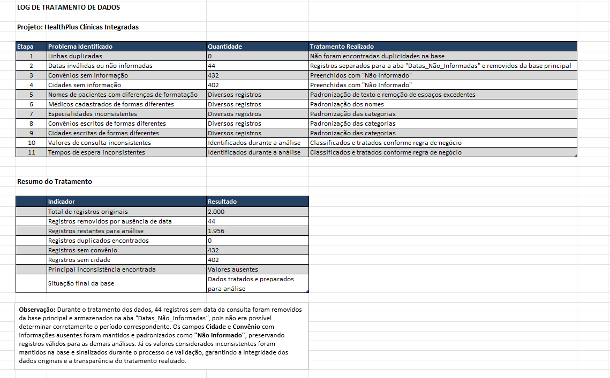
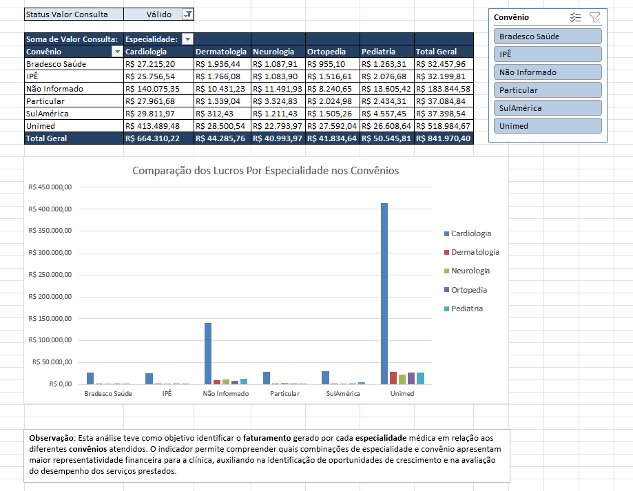
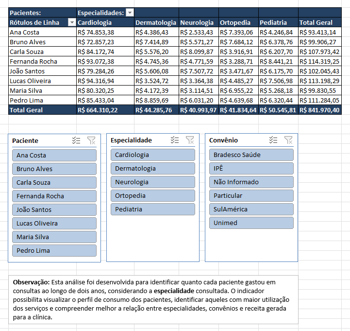
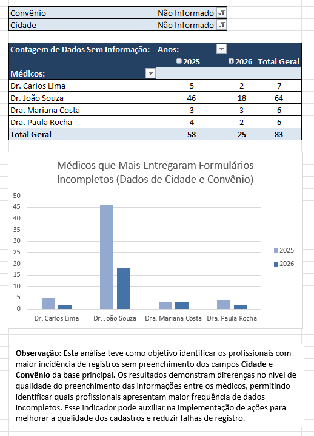

# Projeto_HealthPlus_Consultas_Médicas_Excel
Projeto de análise de consultas médicas desenvolvido no Excel, com tratamento, padronização, criação de KPIs e análise dos dados.

# Análise de Consultas Médicas - HealthPlus 

Projeto de análise e tratamento de dados desenvolvido utilizando Excel.

## O projeto

A proposta foi trabalhar com uma base de dados ficticia chamada HealthPlus,
realizando uma análise inicial, identificando inconsistências e
aplicando tratamentos para melhorar a qualidade dos dados.

##  Processo

**Dados brutos**
->
**Análise exploratória**
->
**Identificação de inconsistências**
->
**Tratamento dos dados**
->
**Base tratada**
->
**Análise e indicadores**

## Ferramentas

- Excel
- Fórmulas
- Tabelas Dinâmicas
- Tratamento e padronização de dados
- Indicadores

## Análises realizadas

- Convênios Médicos
- Especialidades
- Pacientes
- Dados faltando
- Datas faltando
- Qualidade dos dados

## Principais resultados

- 2.000 registros analisados
- 1.956 registros na base tratada
- 44 registros identificados com problemas relacionados às datas
- Identificação e tratamento de inconsistências cadastrais

## Arquivo

O projeto completo está disponível em:

[dados completos em Excel do projeto HealthPlus](Projeto_HealthPlus_Excel.xlsx)

## Status do projeto
Este projeto foi desenvolvido como parte dos meus estudos em Excel e Análise de Dados, permitindo colocar na prática conhecimentos de tratamento, organização e análise de informações.

A partir dele, pude praticar o processo de trabalhar com uma base de dados desde os dados brutos até a criação de indicadores e análises que facilitam a interpretação dos resultados.

Este projeto representa uma etapa importante do meu aprendizado e faz parte da construção do meu portfólio na área de Análise de Dados.

# Visualização do Log de Tratamento

Registro das etapas de tratamento realizadas na base, com identificação das inconsistências encontradas e das ações aplicadas para padronização e organização dos dados.

# Visualização das KPIs

## Faturamento por Especialidade e Convênio

Análise do faturamento gerado pelas diferentes especialidades médicas em cada convênio atendido pela clínica.

A utilização de tabela dinâmica, filtros e gráfico permite comparar o desempenho financeiro das especialidades e identificar quais combinações entre convênio e especialidade apresentam maior representatividade no faturamento.

## Análise de Gastos por Paciente

Análise do valor total das consultas realizadas por cada paciente, considerando as diferentes especialidades médicas.

A análise permite identificar o perfil de consumo dos pacientes e observar quais possuem maior utilização dos serviços, além de possibilitar comparações entre especialidades e valores gerados.

## Identificação de Dados Incompletos

Análise dos registros que apresentam informações ausentes nos campos de Cidade e Convênio.

O indicador permite identificar os profissionais com maior quantidade de registros incompletos e comparar a ocorrência desses dados entre os anos de 2025 e 2026, auxiliando na identificação de pontos que precisam de atenção na qualidade da base.
